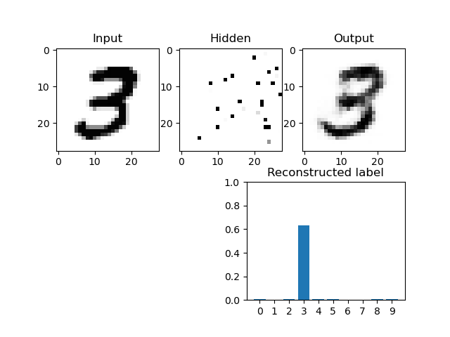
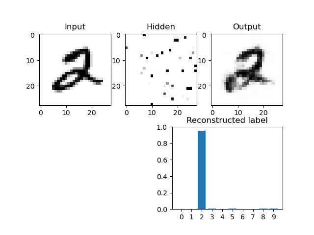
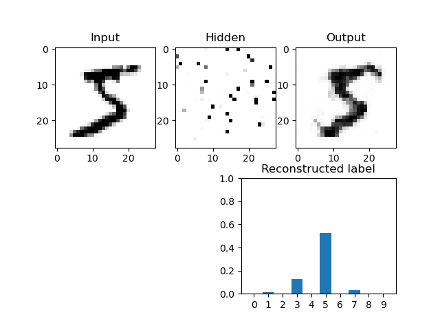

# Number prediction

The goal is to predict and reconstruct handwritten numbers with a Restricted Boltzmann Machine.
Therefore, we train the neuronal network and afterwards drop the labels as input.
The autoencoder network is now able to predict nevertheless the original number with an accuracy of 98% with only 1000
episodes.
Overall it is possible to make the hidden layer smaller with the benefit of save the same information with fewer
neurons.

